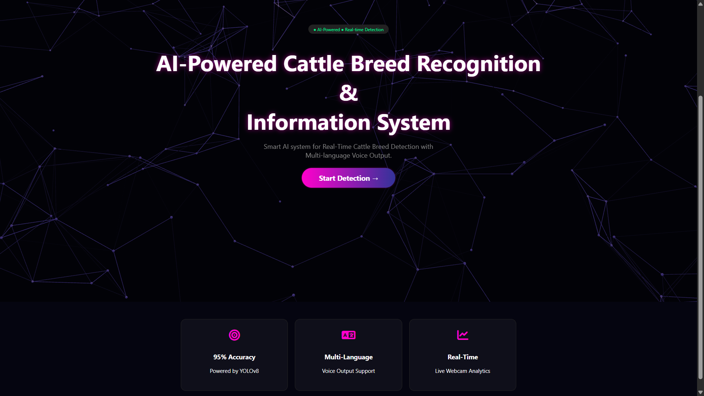
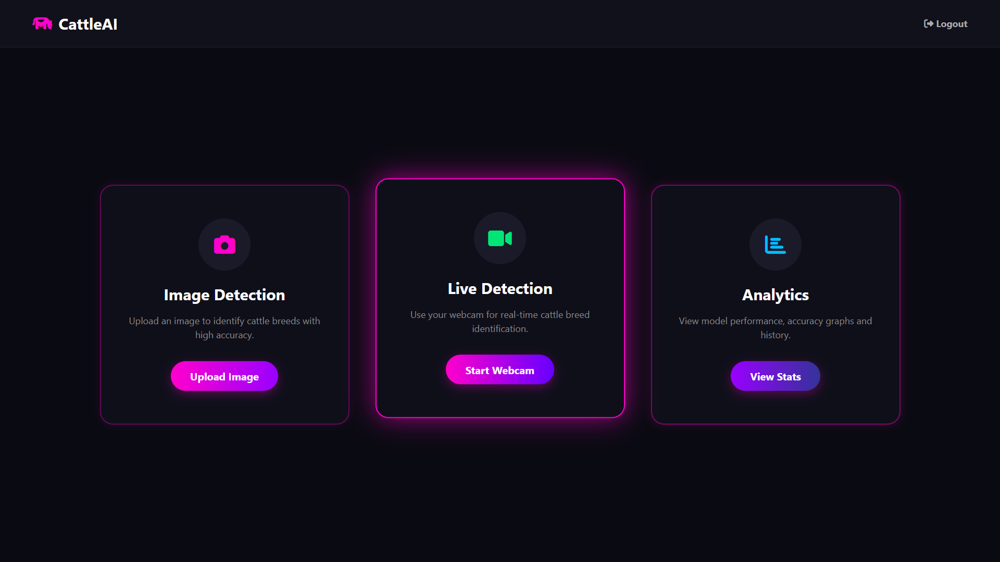
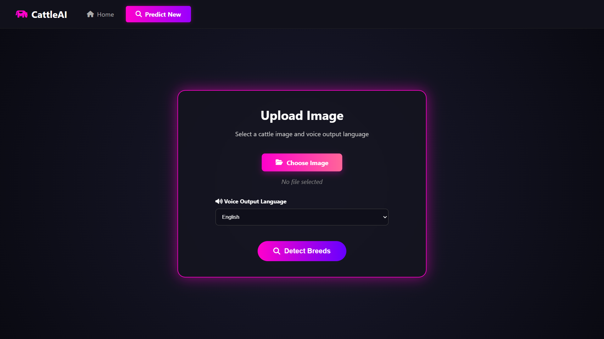
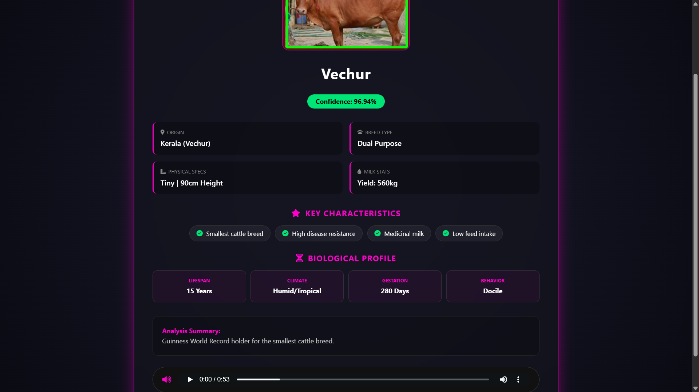
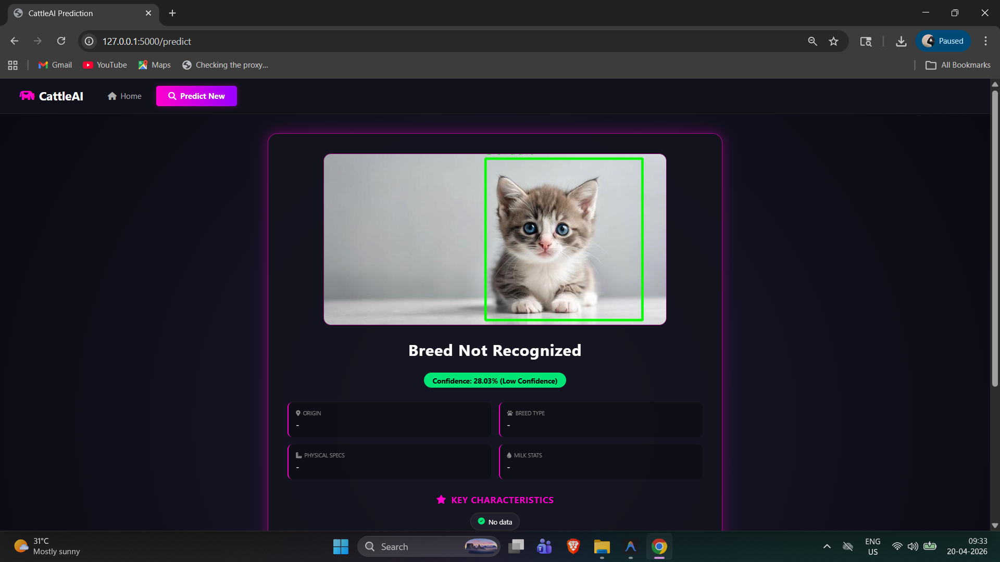
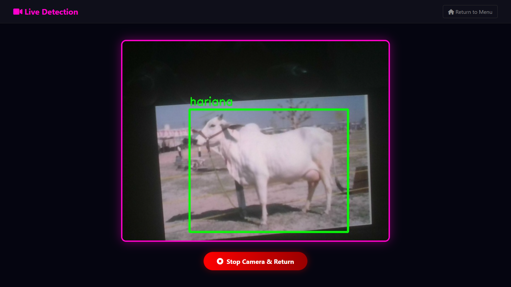
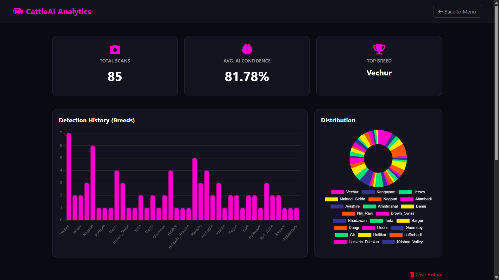
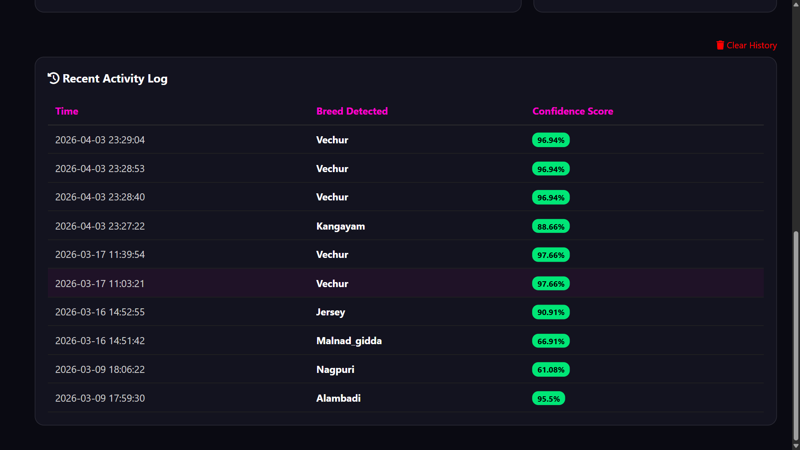

# CattleAI

## Overview

CattleAI is an AI-powered web application that identifies cattle breeds from images and provides detailed breed information along with multilingual voice output.
The system supports detection of **39 cattle breeds** and is designed for ease of use in agricultural and rural environments.

## Problem Statement

Farmers and livestock owners often face difficulty in accurately identifying cattle breeds, especially in rural areas where expert assistance is limited. This lack of accurate identification can lead to poor decisions in breeding, health management, and overall productivity.

## Solution

CattleAI is an AI-powered system that automatically detects cattle breeds from images and provides detailed breed information. It also supports multilingual voice output, making the system accessible to users who may not rely on text-based interfaces.

## Key Features

* Image-based cattle breed recognition using deep learning
* Supports **39 different cattle breeds**
* Displays breed-specific information (stored and structured efficiently)
* Maintains scan history using JSON-based storage
* Multilingual voice output for accessibility (Malayalam, English, Hindi, Telungu, Kannada, Tamil)
* Simple and responsive web interface

## Tech Stack

* **Frontend:** HTML, CSS, JavaScript, Bootstrap
* **Backend:** Python (Flask)
* **Model:** YOLOv8 (Ultralytics)
* **Data Handling:** Python dictionaries + JSON storage
* **Audio:** Text-to-speech (gtts) for multilingual output

## How It Works

1. User uploads an image or uses live detection
2. Model identifies the cattle breed
3. System retrieves breed information
4. Displays results + generates voice output

## Applications

* Farmers and livestock owners
* Veterinary support systems
* Educational and agricultural tools

## Future Scope

* Mobile app integration
* Cloud deployment
* Expanded breed dataset
* Improved accuracy with larger training data

## Screenshots

### Home Page

### 📊 Dashboard

### Image Upload

### Successful Prediction

### Unknown Detection

### Live Detection

### Analytics Overview

### Detection History

